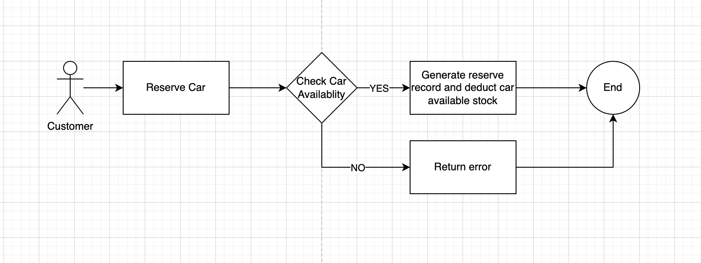
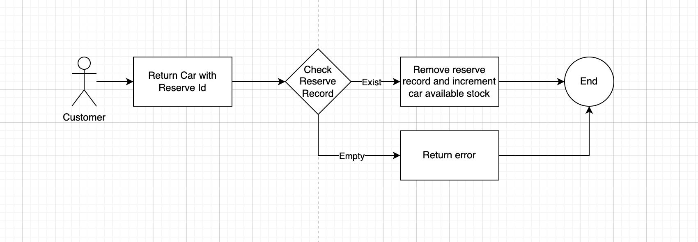

### About me
It's ***Rental Car Booking API***, it contains below functions:
- customers can see all the cars for rental
- customers can reserve a specific for days
- customers can see reserve records by car
- customers can return car by reserve record

### How it works
- #### Reserve Car Flow


- #### Return Car Flow


### API Endpoints

#### 1. Query All Rental Car Information
if success, will return list of rental car information
```
GET "http://localhost:8080/api/cars"
```
response:
```json
{
  "errorCode": null,
  "errorMsg": null,
  "data": [
    {
      "carId": "db08af51-bbb7-437a-ad4d-a2b3ceb313d8",
      "model": "BMW 650",
      "stock": 2,
      "available": 2
    },
    {
      "carId": "231e8f19-e94f-4f53-9c7c-4f52e1ed889c",
      "model": "Toyota Camry",
      "stock": 2,
      "available": 2
    }
  ],
  "success": true
}
```

#### 2. Reserve Car
if success, will return the reserve record, else will return the error code
```
POST "http://localhost:8080/api/cars/{carId}/reserves/"
```
request:
```json
{
  "reserveDays": 1
}
```

response:
- success case:
```json
{
  "errorCode": null,
  "errorMsg": null,
  "data": {
    "reserveId": "9b06b3de-9a55-48c5-8223-32607fd3fe53",
    "carId": "db08af51-bbb7-437a-ad4d-a2b3ceb313d8",
    "reserveTime": "2022-11-24 09:02:29",
    "expectedReturnTime": "2022-11-25 09:02:29"
  },
  "success": true
}
```
- error case:
```json
{
  "errorCode": "NO_AVAILABLE_CAR",
  "errorMsg": null,
  "data": null,
  "success": false
}
```

#### 3. Query All Reserve Records by Car
if success, will return list of reserve records
```
curl -X GET "http://localhost:8080/api/cars/{carId}/reserves/"
```
response:
```json
{
  "errorCode": null,
  "errorMsg": null,
  "data": [
    {
      "reserveId": "c8c39966-962b-4a64-baec-02780fe93d71",
      "carId": "db08af51-bbb7-437a-ad4d-a2b3ceb313d8",
      "reserveTime": "2022-11-24 09:08:48",
      "expectedReturnTime": "2022-11-25 09:08:48"
    },
    {
      "reserveId": "9b06b3de-9a55-48c5-8223-32607fd3fe53",
      "carId": "db08af51-bbb7-437a-ad4d-a2b3ceb313d8",
      "reserveTime": "2022-11-24 09:02:29",
      "expectedReturnTime": "2022-11-25 09:02:29"
    }
  ],
  "success": true
}
```
#### 4. Return Car
if success, will return the car's latest reserve records, else will return the error code
```
DELETE "http://localhost:8080/api/cars/{carId}/reserves/{reserveId}"
```
response:
- success case:
```json
{
  "errorCode": null,
  "errorMsg": null,
  "data": [
    {
      "reserveId": "c8c39966-962b-4a64-baec-02780fe93d71",
      "carId": "db08af51-bbb7-437a-ad4d-a2b3ceb313d8",
      "reserveTime": "2022-11-24 09:08:48",
      "expectedReturnTime": "2022-11-25 09:08:48"
    }
  ],
  "success": true
}
```
- error case:
```json
{
  "errorCode": "INVALID_RESERVE_ID",
  "errorMsg": null,
  "data": null,
  "success": false
}
```